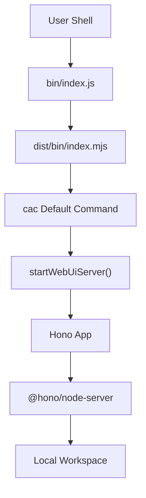

# Minimal CLI Workspace Plan

## Goal

Turn the package into a minimal executable CLI. The first version has one default behavior: running `foundry` opens a local Foundry workspace at `http://127.0.0.1:7777`.

This phase does not add named subcommands. The public package entrypoint in `src/index.ts` stays unchanged.

## Architecture



## Implementation

- `package.json` exposes the CLI with `"foundry": "./bin/index.js"` and publishes both `bin` and `dist`.
- `bin/index.js` stays as the minimal executable wrapper:

  ```js
  #!/usr/bin/env node
  import '../dist/bin/index.mjs';
  ```

- `tsdown.config.ts` maps `src/bin/index.ts` to `dist/bin/index.mjs` while keeping `src/index.ts` as the package API entry.
- `src/bin/index.ts` uses `cac` for the default command and `consola.box` for the startup message.
- `src/bin/server.tsx` defines the Hono app, renders a simple JSX page at `/`, and starts `@hono/node-server`.
- `tsconfig.json` enables Hono JSX with `jsx: "react-jsx"` and `jsxImportSource: "hono/jsx"`.
- `AGENTS.md` records the project conventions for `cac`, `consola`, Hono, extensionless local imports, and blank-line style.
- `README.md` documents the minimal build and run flow.

## Behavior

- Host is hard-coded to `127.0.0.1`.
- Port is hard-coded to `7777`.
- The CLI help text describes the default action as opening a local Foundry workspace.
- The startup message is printed with `consola.box`.
- The Hono app serves its page only at `/`.
- No dedicated CLI test file is included in this minimal snapshot.

## Verification

- `pnpm run lint`
- `pnpm run build`
