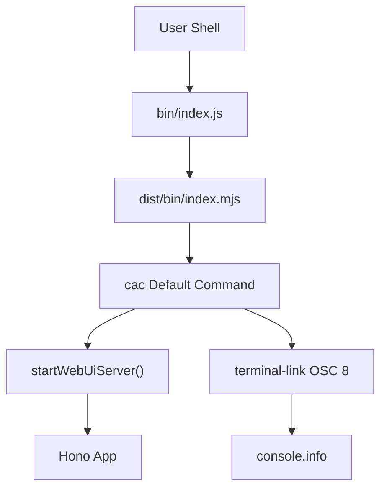

# Clickable CLI Startup URL Plan

## Goal

Make the workspace URL printed at CLI startup clickable in modern terminals (Cursor/VS Code, iTerm2, WezTerm, etc.). Replace `consola.box` with a simple one-line startup message.

The public package entrypoint in `src/index.ts` stays unchanged.

## Architecture



## Dependency Changes

### Add

- `terminal-link` — wraps the URL in OSC 8 hyperlinks so supported terminals can open it with Cmd+click; uses `supports-hyperlinks` for capability detection.

### Remove

- `consola` — only used for `consola.box` on startup; replaced by `terminal-link` plus `console.info`.

### Commands (manual only)

```bash
pnpm remove consola
pnpm add terminal-link
```

## Implementation

- `src/bin/index.ts` calls `terminalLink(webUi.url, webUi.url, { fallback: false })` and prints a one-line message via `console.info` after `startWebUiServer()`.
- `AGENTS.md` updates CLI conventions: use `terminal-link` for clickable URLs; document plan dependency-change and post-execution persistence rules.

## Behavior

- Host remains hard-coded to `127.0.0.1`; port remains `7777`.
- Startup output is a single line: `Foundry workspace is running at <url>`.
- `fallback: false` keeps unsupported terminals from printing the URL twice.
- Apple Terminal.app does not support OSC 8; the URL still displays as plain text.

## Verification

- `pnpm run lint`
- `pnpm run test`
- `pnpm run build`
- Run `foundry` in Cursor terminal; Cmd+click the URL to open `http://127.0.0.1:7777`.
