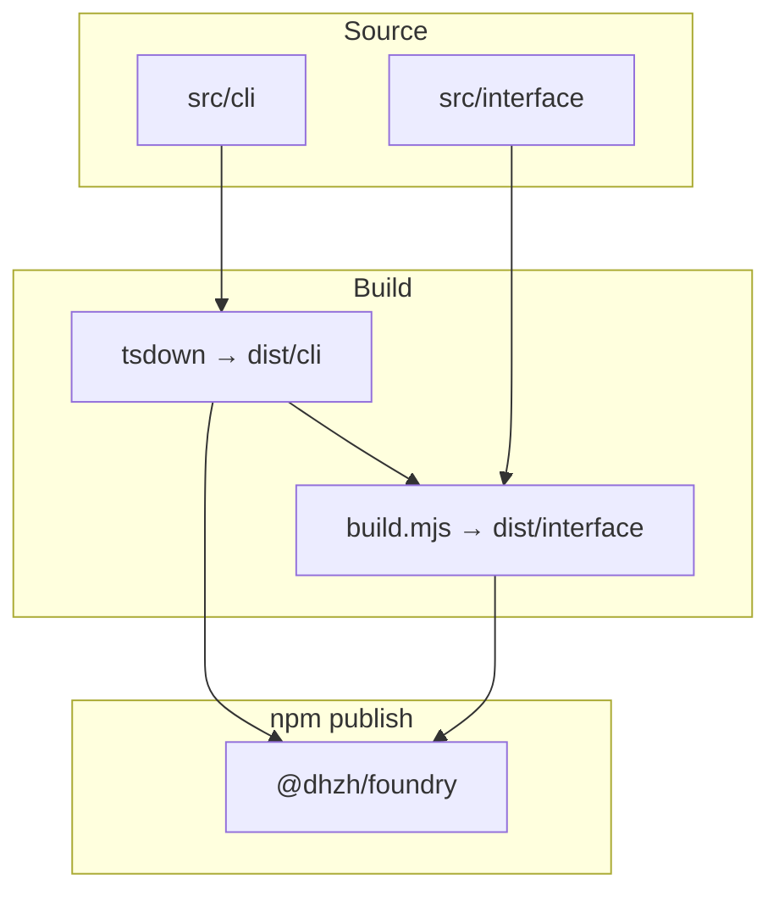

# Single-Package Interface Separation

## Goal

Split the CLI-only `@dhzh/foundry` package into `src/cli` and `src/interface` without monorepo:

- `src/cli` — cac entry and Hono static server
- `src/interface` — static Web UI (Phase 1: `index.html` only)

Remove the library API (`src/index.ts`, `exports`). Users install only CLI `dependencies`; interface build tools stay in `devDependencies` in later phases.

## Architecture



## Implementation

- Migrated `src/bin/` to `src/cli/`; `server.ts` uses `@hono/node-server/serve-static`.
- Added `src/interface/index.html` and root `scripts/build-interface.mjs`.
- `tsdown` entry: `src/cli/index.ts` → `dist/cli/index.mjs`.
- `bin/index.js` imports `dist/cli/index.mjs`.
- Root `package.json`: `build:cli`, `build:interface`, `dev:cli`; removed `exports`, `main`, `types`.

## Behavior

- Host `127.0.0.1`, port `7777`.
- CLI fails if `dist/interface/index.html` is missing.
- `serveStatic` serves from `dist/interface/`.

## Publish model

- Tarball: `bin/`, `dist/cli/`, `dist/interface/`.
- `dependencies`: CLI runtime (`cac`, `hono`, `@hono/node-server`, `terminal-link`) — required because tsdown externalizes them.
- No programmatic API (`exports` removed).

## Dependency Changes

### This phase

No new dependencies. Keep existing `dependencies` and `devDependencies`.

### Phase 2 (React/Vite interface)

Add to root `devDependencies` only:

```bash
pnpm add -D react react-dom vite @vitejs/plugin-react @types/react @types/react-dom
```

## Verification

- `pnpm run build` → `dist/cli/index.mjs` + `dist/interface/index.html`
- `foundry` → `http://127.0.0.1:7777` shows interface page
- `pnpm run lint`

## Phase 2 (not in this milestone)

- React + Vite in `src/interface`
- SPA routing fallback
