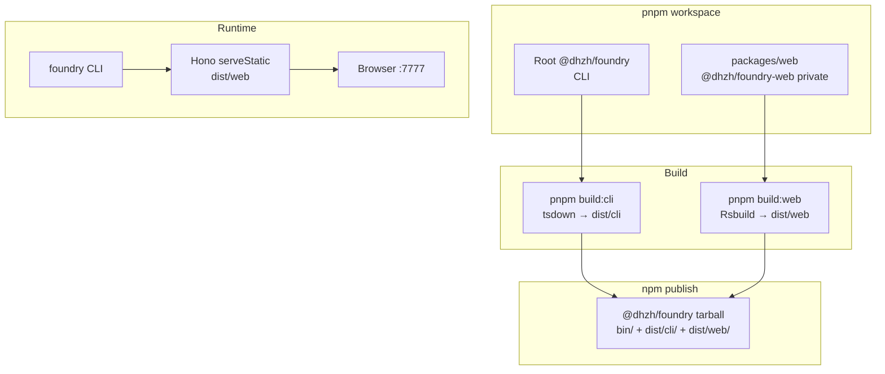

# Monorepo Web UI

## Goal

Move the Web UI into a pnpm workspace package `packages/web` while keeping the CLI at the repository root. The published `@dhzh/foundry` tarball still ships a single CLI with an embedded static Web UI at `dist/web/`.

This supersedes [003-single-package-interface.md](./003-single-package-interface.md) Phase 2 (React in root `src/interface/`).

## Architecture



## Implementation

### Workspace

- [`pnpm-workspace.yaml`](../../pnpm-workspace.yaml): `packages: ['packages/*']` and shared `catalog` for `@types/node`, `tailwindcss`, `typescript`.
- Removed root `src/interface/` and `scripts/build-interface.mjs`.

### CLI

- [`src/cli/index.ts`](../../src/cli/index.ts) — default command starts Web UI at `http://127.0.0.1:7777`.
- [`src/cli/server.ts`](../../src/cli/server.ts) — `resolveWebRoot()` + `serveStatic` from `dist/web/` (`../web` relative to `dist/cli/index.mjs`).
- Fails fast if `dist/web/index.html` is missing.
- [`bin/index.js`](../../bin/index.js) — `import '../dist/cli/index.mjs'`.

### Web UI package (`packages/web`)

| Item | Detail |
|------|--------|
| Package name | `@dhzh/foundry-web` (`private: true`) |
| Stack | Rsbuild 2, `@rsbuild/plugin-react` (React Compiler), `@rsbuild/plugin-tailwindcss` |
| Runtime | React 19, React DOM |
| Source | `src/index.tsx`, `src/app.tsx`, `src/index.css`, `src/env.d.ts` |
| Config | [`rsbuild.config.ts`](../../packages/web/rsbuild.config.ts), [`tsconfig.json`](../../packages/web/tsconfig.json) |
| Output | `dist/web/` (`output.distPath` → `../../dist/web`) |

Web package scripts:

| Script | Command |
|--------|---------|
| `dev` | `rsbuild --open` |
| `build` | `rsbuild build` |
| `preview` | `rsbuild preview` |

### Root scripts

| Script | Action |
|--------|--------|
| `build` | `build:cli` then `build:web` |
| `build:cli` | `tsdown` → `dist/cli/` |
| `build:web` | `pnpm run --filter @dhzh/foundry-web build` |
| `dev:cli` | `tsx watch` on `src/cli/index.ts` |
| `dev:web` | `pnpm run --filter @dhzh/foundry-web dev` |
| `preview:web` | `pnpm run --filter @dhzh/foundry-web preview` |

### TypeScript

- Root [`tsconfig.json`](../../tsconfig.json) — CLI + root config files; `"exclude": ["packages"]`.
- [`packages/web/tsconfig.json`](../../packages/web/tsconfig.json) — Web UI with `jsx: react-jsx`, DOM lib, `verbatimModuleSyntax`.
- [`packages/web/src/env.d.ts`](../../packages/web/src/env.d.ts) — `/// <reference types="@rsbuild/core/types" />`.

## Publish model

- `files: ["bin", "dist"]`, `prepack` runs full build.
- `@dhzh/foundry-web` is private and not published separately.
- CLI `dependencies`: `cac`, `hono`, `@hono/node-server`, `terminal-link` (tsdown externalizes them into the bundle context).

## Dependency Changes

### Add (`packages/web`)

- `react`, `react-dom` — SPA runtime.
- `@rsbuild/core`, `@rsbuild/plugin-react`, `@rsbuild/plugin-tailwindcss` — build tooling.
- `@types/react`, `@types/react-dom` — React TypeScript types.
- `tailwindcss`, `typescript`, `@types/node` — via workspace `catalog`.

### Add (root)

- No Web UI runtime dependencies.
- Root orchestrates builds via `pnpm run --filter @dhzh/foundry-web`.

### Remove

- Root `src/interface/index.html` and `scripts/build-interface.mjs`.

### Commands (reference)

```bash
pnpm add --filter @dhzh/foundry-web react react-dom
pnpm add -D --filter @dhzh/foundry-web \
  @rsbuild/core @rsbuild/plugin-react @rsbuild/plugin-tailwindcss \
  @types/react @types/react-dom tailwindcss typescript @types/node
```

Catalog in `pnpm-workspace.yaml`:

```yaml
catalog:
  '@types/node': ^26.1.0
  tailwindcss: ^4.3.2
  typescript: ^6.0.3
```

## Verification

- `pnpm run build` → `dist/cli/index.mjs` + `dist/web/index.html` + assets
- `node bin/index.js` → `http://127.0.0.1:7777` serves the Web UI
- `pnpm run dev:web` → Rsbuild dev server with HMR
- `pnpm run lint`

## Out of scope

- Moving CLI to `packages/cli`
- Client-side routing / Hono SPA fallback
- Dual npm package publish
